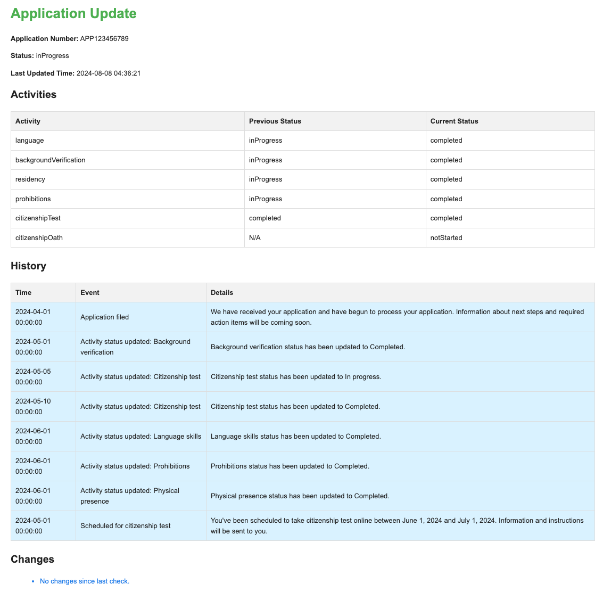

# canada-citizenship-tracker

Effortlessly track your Canadian Citizenship Application and receive instant email notifications for any updates.

### Email API Token

Currently, Email Notifications are sent using Sendgrid.

If you don't have a Sendgrid API Token, get a free token from [here](https://sendgrid.com/en-us/pricing). Free Token
allows you to send up to 100 emails/day.

### Updating Config

- Update `config.json` file with your API Token
- Update `user_profiles` with your username and password, tracking multiple profiles is supported so you can add
  multiple profile details in the `user_profiles` section.
- Adjust `schedule_time_mins` according to your requirement, default is to run tracker every 60 minutes.

## Running the Tracker

### Using Virtual Environment :

Create a virtuelenv :

```shell
python -m venv venv
source venv/bin/activate
pip install -r requirements.txt

# Run tracker
python citizenship_application_tracker.py
```

### Using Docker Container :

Build a docker image :

```shell
docker build -t citizenship_tracker -f Dockerfile .
docker run --name citizenship_tracker -itd citizenship_tracker
```

### Sample Email Notification :


## Future Enhancements :

- Reuse auth token if session is not expired.
- Add more notification options like slack, telegram, SMTP etc.

PRs welcome for any improvements or bug fixes.